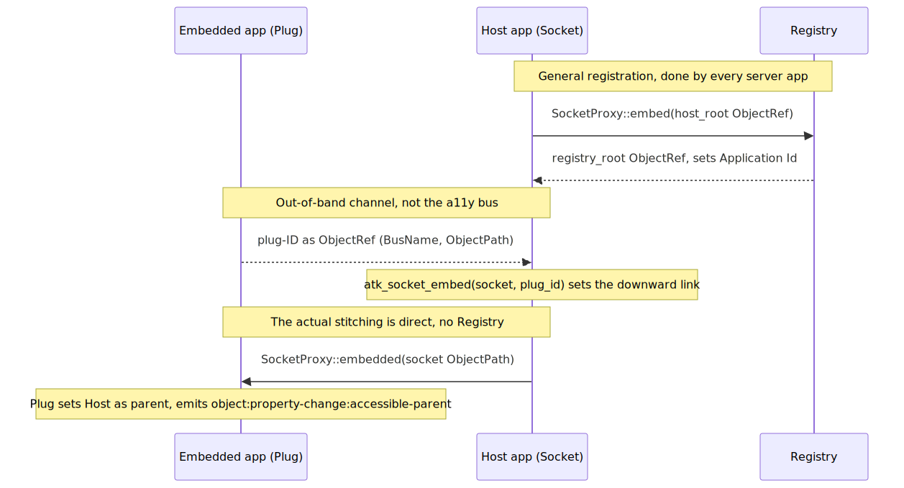

# Socket/Plug Stitching Mechanism

This document describes, as best we can tell from the reference implementation and
real-world consumers, how AT-SPI2 stitches together the accessibility trees of two
separate server-side processes: a **host** (which exposes a *socket*) and an
**embedded app** (which exposes a *plug*). The goal is that an assistive technology
sees one continuous tree and never has to know that two processes are involved.

A classic example is a web browser (the host) embedding a sandboxed web content
process (the plug), as in GNOME Web (Epiphany) with WebKitGTK.

This is a server-side handshake only; assistive technologies do not participate.

## How we think it works

A plug-ID is a `(BusName, ObjectPath)` pair — the same `(so)` shape that
`atspi_common::ObjectRef` models. Note an asymmetry in the `Socket` interface: `Embed`
and `Unembed` take a full `(so)` reference, but `Embedded` takes only the socket's object
path *as a plain string (`s`, not `o`)*; the plug's bus name is taken from the D-Bus
message sender.

1. **Out-of-band plug-ID transfer.** The embedded process sends its plug-ID (bus name
   and object path) to the host over a private channel — *not* the accessibility bus.
   In ATK this is a private D-Bus message; WebKit cannot do this with GDBus and instead
   uses its own IPC.
2. **Host records the downward link.** The host calls `atk_socket_embed(socket, plug_id)`
   locally, storing the plug-ID on its socket object so the plug appears as a child of
   the socket.
3. **Host notifies the plug (the actual stitching).** The host sends
   `org.a11y.atspi.Socket.Embedded(socket_path)` *directly* to the plug object. To receive
   this, the plug must implement the `Socket` interface on its root object; the host only
   calls the method. The registry is not involved here.
4. **Plug records the upward link.** The plug sets the host's socket as its parent and
   emits an `object:property-change:accessible-parent` event (a `PropertyChange` on the
   `org.a11y.atspi.Event.Object` interface, carrying `Property::Parent`). Before this
   point, querying the plug's parent yields a null reference.

Separately, and not part of the stitching above, every server application registers
itself with the registry by calling `org.a11y.atspi.Socket.Embed` on the registry root
(`/org/a11y/atspi/accessible/root`). The registry then assigns the application its `Id`
and returns its own root reference. Notably, a plug does not perform this `Embed` step;
it becomes reachable via the reference the host holds for it.

<!--
  TODO: Confirm with AccessKit / Arnold.
  AccessKit  performs the general `Socket.Embed` registration. 
  It is NOT yet confirmed whether AccessKit also implements the cross-process plug/socket embedding.

   Plug sends ObjectRef to host.
   Host stores the ID (the ObjectRef) as child in it's tree
   Host calls `Socket::Embedded` on the plug's root object with the path (as string).
   Plug stores ObjectRef as parent and sends `object:property-change:accessible-parent` event.
   
  - Does AccessKit provide something for the out-of-band initiation for plug and host?
  - What is AccessKit's `atk_socket_embed(socket, plug_id)` equivalent, if it has one?
  - Does it implement Socket::Embedded for a 'plug' process?
  - Does it set host as parent and emit Object::PropertyChange with Property::Parent(ObjectRefOwned) for the plug process?
  
If either of these exist, let's document that here too.
-->

## Sources

- `socket_embed_hook` and `register_application` in at-spi2-core `atk-adaptor/bridge.c`
  (host sends `Embedded` directly to the plug; only non-plug apps call `Embed`):
  <https://gitlab.gnome.org/GNOME/at-spi2-core/-/blob/main/atk-adaptor/bridge.c>
- `org.a11y.atspi.Socket` interface reference (`Embed`, `Embedded`, `Unembed`):
  <https://gnome.pages.gitlab.gnome.org/at-spi2-core/devel-docs/doc-org.a11y.atspi.Socket.html>
- `Atk.Socket` documentation (socket as container of a plug; who sends the plug-ID):
  <https://gnome.pages.gitlab.gnome.org/at-spi2-core/atk/class.Socket.html>
- WebKit commit e3254ab (out-of-band plug-ID transfer between UI and web process):
  <https://github.com/WebKit/WebKit/commit/e3254ab398aeb4c95f518f2a18439e19aa653137>
- WebKit commit 37fd221 (null parent reference until embedded; parent set on embed):
  <https://github.com/WebKit/WebKit/commit/37fd221b83b8d1afd020e2e608bccdd1651c83a9>
